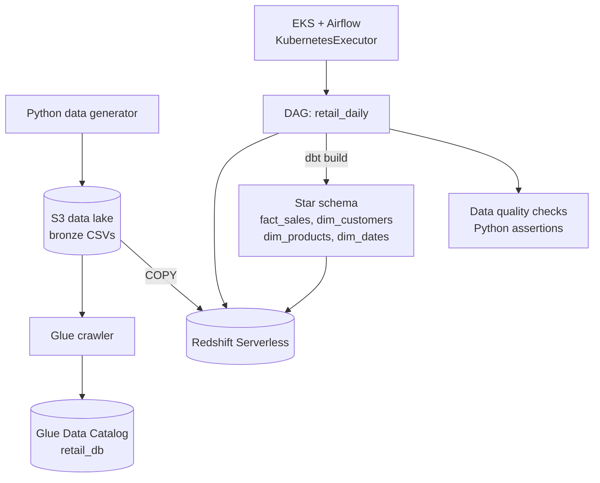

# AWS Retail Analytics Platform

A production-style retail analytics platform on AWS, built end-to-end with Terraform: synthetic sales data lands in an S3 data lake, Airflow (on EKS) orchestrates daily loads into Redshift Serverless, dbt builds a star schema, Glue catalogs the lake, and data quality checks gate every run.

## Architecture



## Pipeline stages

| Stage | What happens |
|---|---|
| Bronze | `data_gen/generate_retail.py` writes customers, orders, products CSVs to `s3://<bucket>/bronze/` |
| Orchestration | Airflow DAG `retail_daily` — 5 tasks, each running as a Kubernetes pod |
| Load | `COPY` from S3 into `staging` tables (TRUNCATE + load) |
| Transform | dbt: staging views → `dim_customers`, `dim_products`, `dim_dates`, `fact_sales` in `analytics` |
| Quality | Python assertions: fact table non-empty, zero null foreign keys |
| Catalog | Glue crawler infers schemas, registers bronze tables in `retail_db` |

## Verified results

- 15,722 raw orders → 9,417 fact rows (59.9% — matches the generator's completed-order ratio)
- 0 null foreign keys in the fact table
- Full DAG green on KubernetesExecutor; IRSA verified (no static AWS keys in pods)

## Repository layout

```
terraform/   # VPC, EKS, Redshift Serverless, IAM roles, S3
helm/        # Airflow Helm values (KubernetesExecutor, GitSync)
dags/        # retail_daily.py
dbt/         # models, sources, profiles
data_gen/    # synthetic retail data generator
```

## Reproducing

Prereqs: AWS CLI, Terraform, kubectl, Helm.

```bash
cd terraform && terraform init && terraform apply
python data_gen/generate_retail.py   # generates + uploads to S3
# Install Airflow via Helm, port-forward the API server,
# add the redshift_default connection, trigger retail_daily
```

## Teardown

```bash
aws s3 rm s3://retail-analytics-lake-495249387077 --recursive
cd terraform && terraform destroy
```

## Notes

- Built as a time-boxed sandbox under a $20 budget guardrail: Redshift is publicly reachable and the Airflow metadata DB runs without EBS persistence — fine for a demo, not for production.
